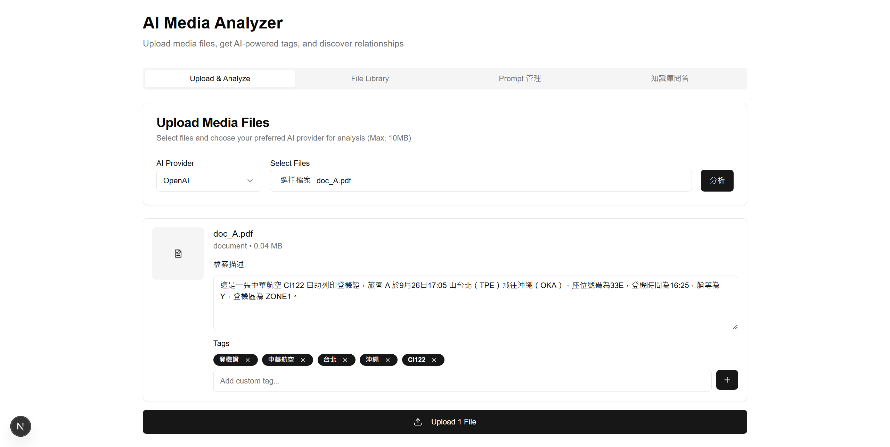
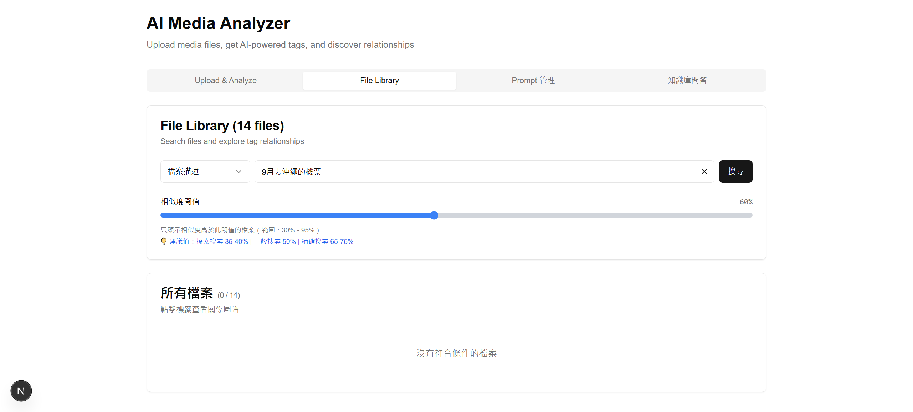
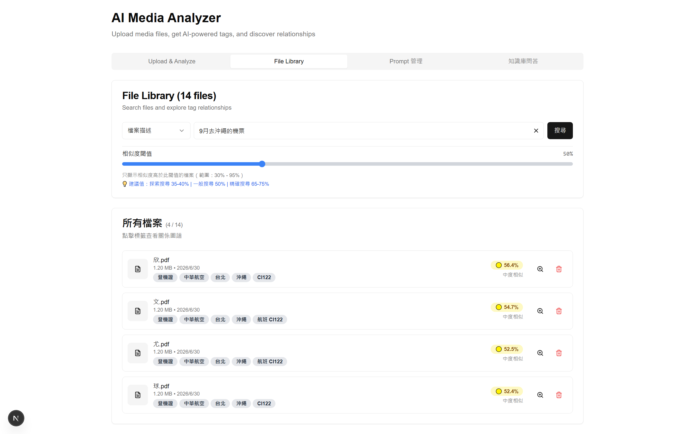
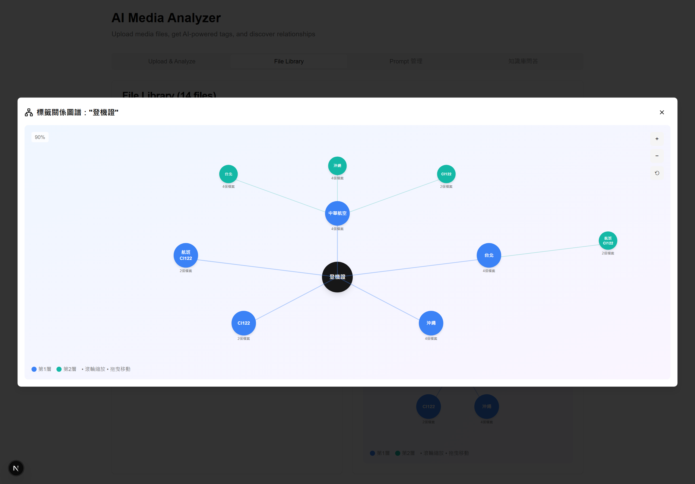
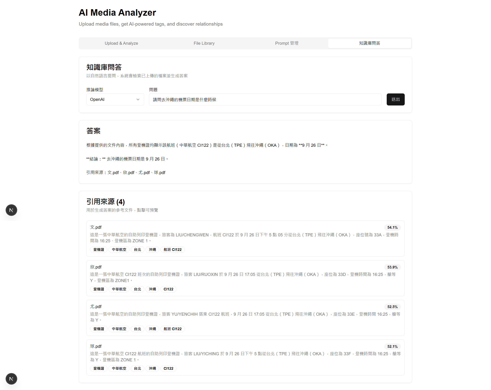
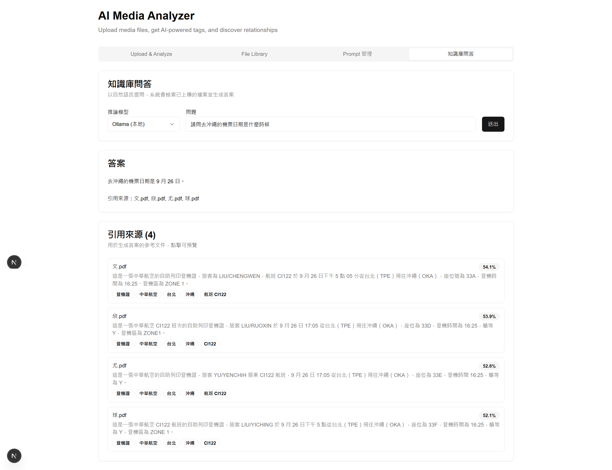
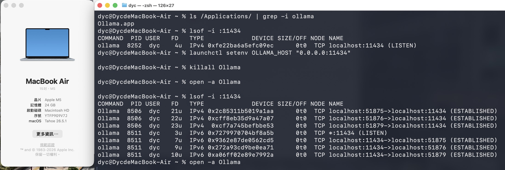
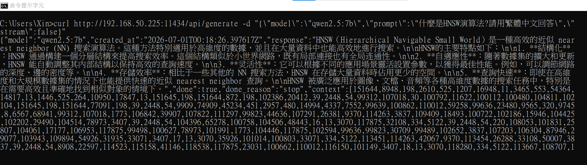

# 基於 AI 的雙軌檢索檔案管理系統

碩士論文《基於人工智慧之雙軌檢索檔案管理方案》
(An AI-Based Dual Track Retrieval Scheme for Document Managements)
的完整實作,含論文口試通過後延伸的端到端 RAG 與 Local LLM 整合。

- **作者**: 尤彥智 (Yen-Chih Yu)
- **指導教授**: 張軒彬 (Dr. Hsung-Pin Chang)
- **學校**: 國立中興大學資訊工程學系

---

## 專案結構

前後端分離架構,分為兩個獨立 repo:

- 🎨 **前端**: [dual-track-retrieval-frontend](https://github.com/Dyc77/dual-track-retrieval-frontend)
  Next.js 15 / React 19 / TypeScript
- ⚙️ **後端**: [dual-track-retrieval-backend](https://github.com/Dyc77/dual-track-retrieval-backend)
  Flask 2.3 / Redis Stack + HNSW / OpenAI / Gemini / Ollama

---

## 論文核心貢獻

1. **雙軌檢索架構(Hybrid Retrieval)**:整合確定性標籤過濾 + 機率性向量探索,
   改善純向量檢索的 over-fetching 與 vocabulary mismatch
2. **動態相似度拉桿**:30–95% 使用者驅動的閾值調整,呼應 SIGMOD 2026 對
   靜態閾值缺陷的批評
3. **視覺化標籤關聯圖譜**:以節點與連線呈現檔案間共現標籤,提升檢索結果可視性
4. **確定性冷熱分層**:避免語意搜尋模糊命中造成 cache pollution
5. **Prompt 解耦配置架構**:依「檔案類型 × Provider」分組,零停機更新

## 論文後延伸實作(2026/7)

為對應 AI 應用職缺 must-have,將論文系統延伸為:

- **端到端 RAG**:雙軌檢索 → context 組裝 → LLM 生成 + 引用來源
- **多模態 RAG**:單一查詢跨 PDF / 圖片 / Word / Excel / PPT 綜合回答
- **Local LLM 部署**:M5 Air + Ollama + Qwen 2.5 7B,跨機器內網服務化架構
- **混合策略**:RAG 生成走本地、Vision 走雲端、Embedding 沿用 OpenAI

---

## Demo 截圖

### 1. 多模態檔案上傳與 AI 標籤萃取

支援 PDF / 圖片 / Word / Excel / PPT 等異質檔案。LLM 自動萃取標籤與描述,
向量嵌入後即時比對相似檔案(範例:上傳新登機證,系統找出 4 份既有相似
檔案,最高相似度 91.7%,並提示可能為重複檔案)。

### 2. Prompt 解耦配置層

所有 Prompt 抽離為獨立配置層,依「檔案類型 × AI Provider」分組管理,
更新後零停機即時生效。

### 3. 動態相似度拉桿:60% 閾值下無結果

自然語言查詢「9 月去沖繩的機票」,在業界慣用的高閾值(60%)下,
14 份檔案中無任何檔案通過門檻。

### 4. 動態相似度拉桿:50% 閾值下找到 4 筆

同一查詢閾值下調至 50% 後,成功召回 4 份登機證(相似度 52.4% – 56.4%)。
此對比實證論文所指「資訊密度不對稱」現象——人類短查詢與 AI 長描述的
合理相似度自然落在 0.4–0.6 區間,而非業界慣用的 0.7 以上。

### 5. 視覺化標籤關聯圖譜

以「登機證」為中心的放射狀節點網路,呈現檔案間的共現標籤與延伸關聯,
提供發散式導航路徑。

### 6. RAG 問答(雲端 LLM)

自然語言提問「去沖繩的機票日期是什麼時候」,系統跨 4 份 PDF 綜合
回答並附引用來源與相似度分數。此範例使用 OpenAI 作為生成層。

提問「請問大興旅行社規劃的北海道旅行是什麼時候,並給我航班號碼」,
系統從行程報價單 PDF 中同時抽取「出發日期(2026 年 10 月 2 日)」
與「航班號(BR116 / BR115)」。

### 7. RAG 問答(本地 Local LLM)

切換至本地 Ollama(Qwen 2.5 7B),同一查詢由 M5 Air 內網推論回答,
驗證論文系統的生成層可平滑替換為 Local LLM,符合私有化部署需求。

---

## Local LLM 部署驗證

### 8. Ollama 於 M5 Air 對外服務(Server 端)

於 M5 Air(Apple M5 / 24GB 統一記憶體 / macOS Tahoe 26.5.1)部署
Ollama 作為 inference server。透過 `launchctl setenv OLLAMA_HOST "0.0.0.0:11434"`
將預設僅監聽 `localhost` 的 Ollama 改為對所有網卡開放,重啟後 `lsof -i :11434`
可見 `TCP *:11434 (LISTEN)`,確認對內網公開推論服務。

### 9. 桌機 (Windows) 透過內網呼叫本地 LLM(Client 端)

於桌機端以 `curl` 呼叫 M5 Air 上的 Ollama 服務
(`http://192.168.50.225:11434/api/generate`),模型 `qwen2.5:7b` 成功
回應繁體中文技術問題(HNSW 演算法說明)。此舉證明「跨機器內網服務化」
架構已實際運作:應用邏輯位於桌機、LLM 推論位於 M5 Air,透過 HTTP 通訊。
此為論文系統可切換至本地私有化部署的關鍵驗證。

---

## Tech Stack

- **前端**: Next.js 15 / React 19 / TypeScript
- **後端**: Flask 2.3 / Python 3.13
- **資料庫**: Redis Stack 7.4(RediSearch + HNSW 向量索引)
- **LLM(雲端)**: OpenAI GPT-5-chat-latest / Google Gemini 2.5 Flash
- **LLM(本地)**: Ollama + Qwen 2.5 7B(Q4_K_M 量化)
- **Embedding**: OpenAI text-embedding-3-small(1536 維)

---

## 論文實驗

- 150 筆真實異質檔案(PDF / 圖 / Word / Excel / PPT 各 30 筆)
- 字串比對 vs. 向量比對雙基線
- 0.2–0.8 相似度閾值掃描 + 人工案例驗證
- 實證「詞彙不匹配」與「資訊密度不對稱」現象

---

## 快速啟動

### 後端

git clone https://github.com/Dyc77/dual-track-retrieval-backend
cd dual-track-retrieval-backend
pip install -r requirements.txt
# 設定環境變數(OPENAI_API_KEY, GEMINI_API_KEY, REDIS_URL 等)
python app.py

### 前端

git clone https://github.com/Dyc77/dual-track-retrieval-frontend
cd dual-track-retrieval-frontend
npm install
npm run dev

### Local LLM(選用)

在有足夠記憶體的機器上(Apple Silicon 建議 16GB+):

# 安裝 Ollama
brew install ollama

# 拉模型
ollama pull qwen2.5:7b

# 開啟對外服務(跨機器使用)
launchctl setenv OLLAMA_HOST "0.0.0.0:11434"
killall Ollama && open -a Ollama
